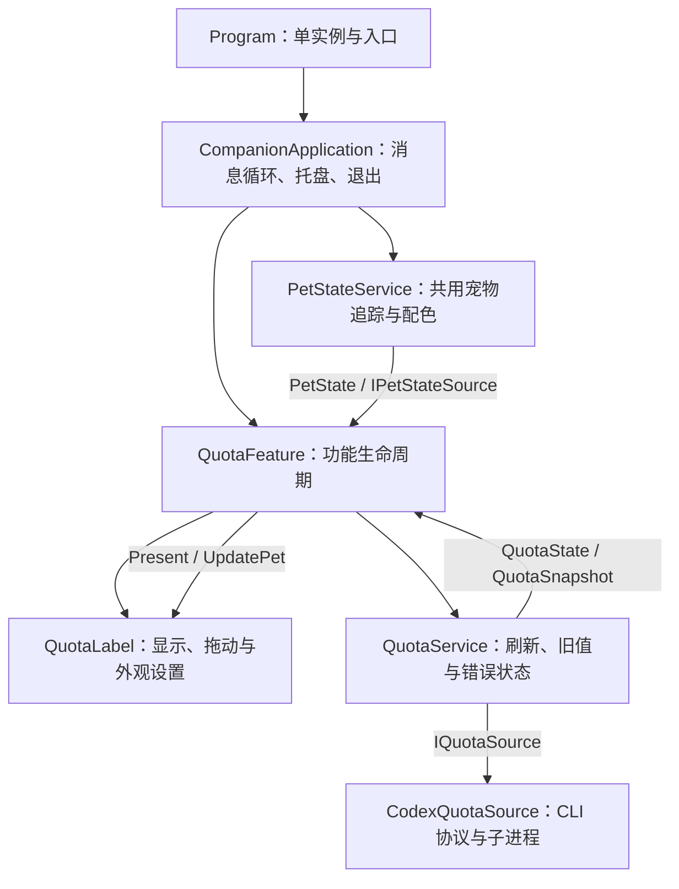

# 架构与扩展约定

PetFolio 的长期方向是围绕 Codex Pet 提供实用功能与互动。Quota Bubble 是第一个功能模块。当前采用单进程内的显式模块注册，先维持清晰边界，再根据第二个实际功能决定进一步抽象。

## 运行结构

`Application.Run` 运行宿主的 `ApplicationContext`。任何单个功能窗口都不是主窗口；停用额度功能后，托盘、消息循环和共用宠物服务继续运行。

## 职责与所有权

| 层 | 负责 | 不应引入的依赖 |
| --- | --- | --- |
| 宿主 | 注册功能、托盘、功能开关、单实例恢复信号、退出、UI 回呼调度 | 额度解析与绘制细节 |
| 宠物服务 | 唯一一份窗口发现、元数据轮询、鼠标观察、位置校正和配色 | 具体功能窗口、额度状态 |
| 额度功能 | 创建与释放自己的视窗、服务、订阅和菜单命令 | 宠物配置键或窗口识别规则 |
| 额度服务 | 五分钟刷新、并发请求合并、失败保留旧值、发布类型化状态 | 具体窗口及 CLI 协议 |
| CLI 来源 | stdio 握手、响应处理、超时、子进程终止 | UI、托盘、显示文案 |
| 额度视窗 | 内容显示、面板拖动、吸附、透明度、隐藏与恢复 | 查询子进程、宠物发现、应用退出 |

`PetState`、`QuotaSnapshot`、`QuotaState` 是只读快照。额外的额度提醒或消耗分析应使用额度模型，不应解析视窗文字。解析后的额度保留窗口时长与重置时间，积分余额不参与剩余额度计算。

所有生命周期操作、事件订阅和视窗更新在 UI 线程进行。后台查询与取色通过宿主持有的调度窗口回到 UI 线程；它们不依赖额度窗口是否可见。释放服务后，已排队的旧结果也不得发布到新实例。

玻璃视窗共用 UI 线程的 Composition dispatcher controller，各自释放自己的合成树、背景源、阴影和窗口。共享 controller 保留至线程／进程退出，避免反复启停或多个面板并存时重复创建。

## 三种不同操作

- **隐藏**：点击 ×；窗口、玻璃与阴影隐藏，额度仍继续刷新，托盘命令可恢复同一视窗。
- **停用功能**：托盘 `Features → Quota Bubble` 取消勾选；取消订阅、停止额度计时器、终止在途查询并销毁视窗。再次启用创建新实例、读取已有外观设置并立即查询。
- **退出应用**：托盘 `Exit` 或 `--stop`；释放所有功能、共用追踪器、鼠标 hook、托盘及调度资源。

功能启用状态仅限当前会话；启动时默认启用额度功能。重复启动程序会启用并恢复额度功能。原有 `appearance.json` 的透明度与方位格式保持兼容。

## 添加下一个功能

1. 实现 `ICompanionFeature`，提供 `Start`、`Stop`、`Restore`、`Dispose` 和菜单命令。
2. 在宿主构造阶段显式创建并 `Register`。需要宠物状态时注入现有 `IPetStateSource`，不要再建立一份宠物轮询或鼠标 hook。
3. `Start` 应可重复调用且不重复订阅；`Stop` 应可重复调用并完整释放功能资源；停止后允许重新启动，最终 `Dispose` 后不再启动。
4. 菜单命令由功能拥有，停用时释放，重新启用时重新创建。宿主只负责把命令加入托盘。
5. 对跨模块边界增加行为测试：停用一个功能不能影响另一个功能，旧异步结果不能污染重启后的实例。

如果未来多个独立模块都需要额度数据，再将 `QuotaService` 提升为宿主共用服务；目前由额度功能拥有，停用即可停止查询。

## 当前边界

- 本次建立的是进程内功能边界，尚无动态加载、第三方插件 SDK 或进程级故障隔离。
- 多面板占位协调尚未实现；现有定位算法仍针对单个面板。第二个实际面板确定后再设计布局协调。
- 玻璃与阴影仍采用现有额度面板的尺寸与圆角；它们不是任意尺寸的通用组件。
- Codex 客户端内部配置键、窗口类名和进程识别集中于宠物服务及其配色辅助组件，仍需跟随客户端版本维护。
- CLI 登录账号与桌面账号的一致性、混合 DPI 多显示器行为仍需现场验证。

## 验证

`test.ps1` 覆盖配色、切换、跟随、位置、额度模型与服务、真实 stdio 假服务器、功能启停与共存。假服务器不读取账号、不访问网络；测试不会查询真实额度。

`build-glass-verification.ps1` 与 `GlassVerification.exe` 验证真实 Windows 玻璃、鼠标命中、关闭／恢复和背景更新。支持 `-OutputDirectory .test-build` 在隔离目录生成程序与截图。

单独验证生产构建可执行 `./build.ps1 -OutputDirectory .test-build`，无需覆盖正在运行的程序。
